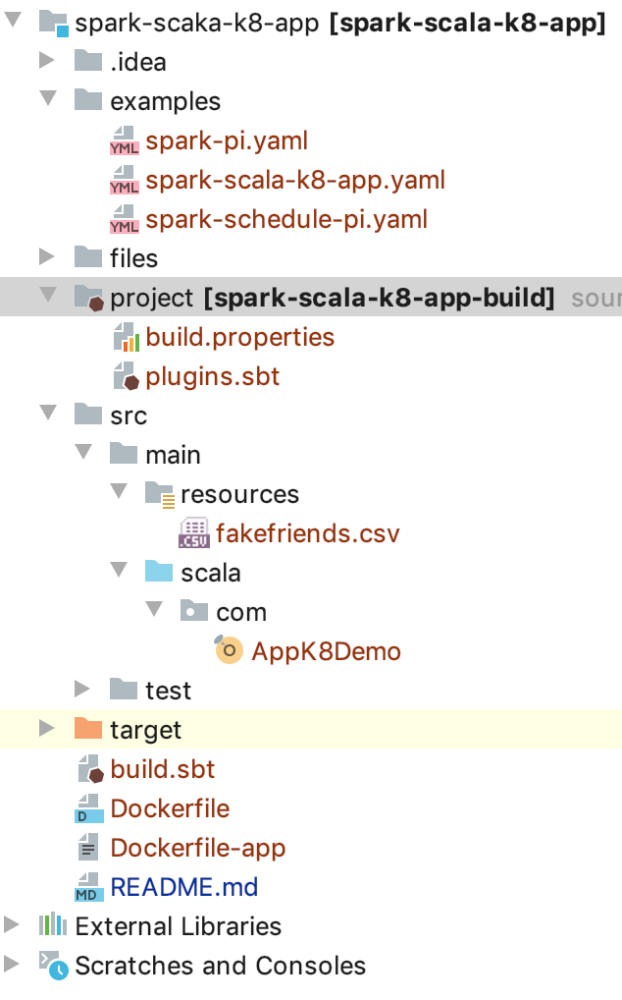

# spark-scaka-k8-app
A simple code on showing how to package the Spark Scala code and deploy it on Kubernetes using spark-on-k8s-operator.

## Project structure



## Set up for packaging
1. Create a project folder.
2. Create a plugins.sbt file inside project folder and add a sbt plugin. This is required for building a flat jar
    ```$xslt
    addSbtPlugin("com.eed3si9n" % "sbt-assembly" % "0.14.10")
    ```
3. Create a build.properties file inside project folder and add a sbt version.
    ```$xslt
    sbt.version=1.3.9
    ```
4. In build.sbt, add the task for merge strategy.
    ```$xslt
    assemblyMergeStrategy in assembly := {
      case "META-INF/services/org.apache.spark.sql.sources.DataSourceRegister" => MergeStrategy.concat
      case PathList("META-INF", xs@_*) => MergeStrategy.discard
      case "application.conf" => MergeStrategy.concat
      case x => MergeStrategy.first
    }
    ```

## Build docker images
1. docker build -t test/spark-operator:latest .
2. docker build -f Dockerfile-app -t test/spark-scala-k8-app:latest .

## Deploy the code on K8
Execute following command to run the code in k8:
```$xslt
kubectl apply -f examples/spark-scala-k8-app.yaml
```
